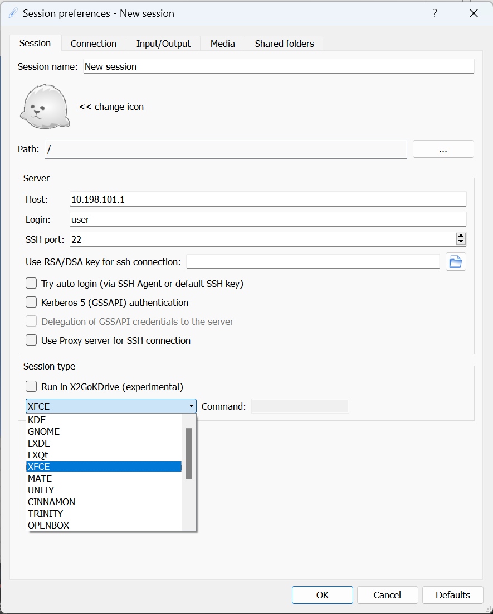
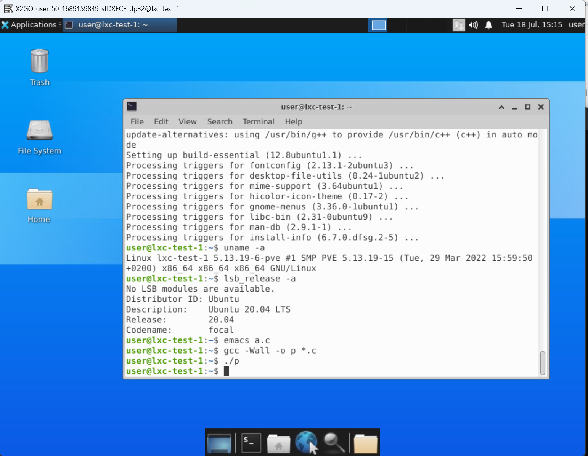
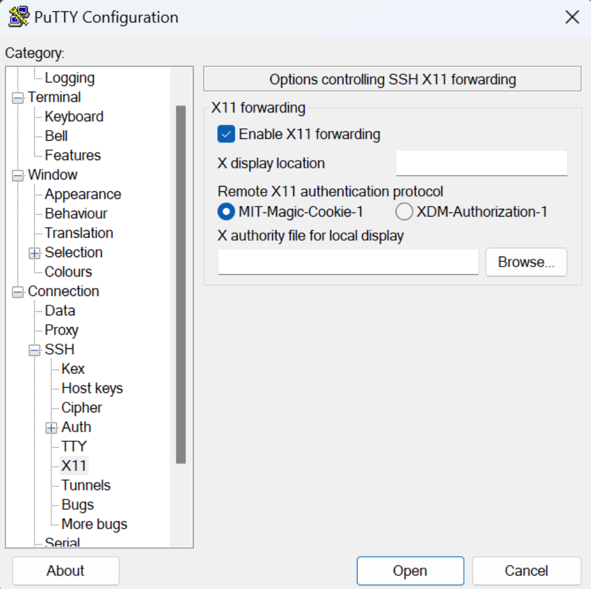
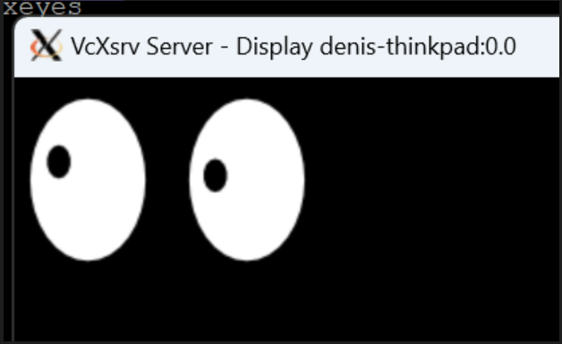
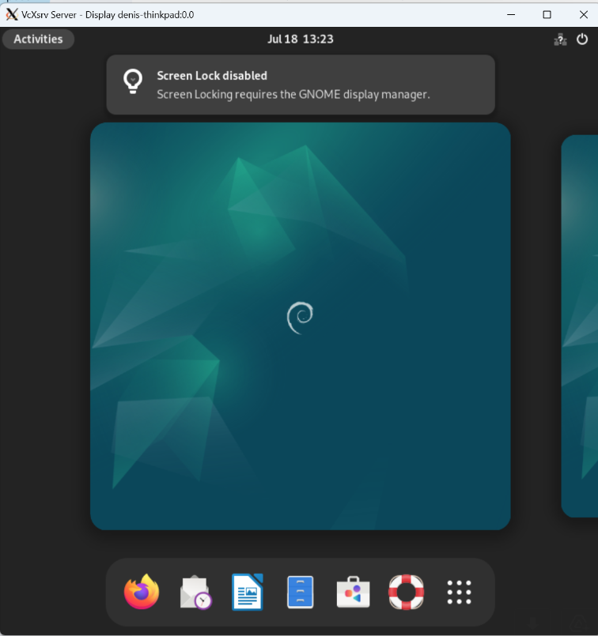

Ever wondered how to get access to a fully working GUI inside an LXC container or run GUI apps inside the container? Then this is the guide for you.

Given an LXC container with Debian installed, our context is as follows, manage to run GUI apps or a full GUI session inside it.

We have 2 methods to do this: the first is to use X2Go client and start a full desktop session and the second is to use X11 forwarding through SSH and run dedicated apps.

## Playground

We have an LXC container with Debian installed as the OS.

We can check the version with the following command.

```bash
cat /etc/issue
```

And the output is:

```bash
Debian GNU/Linux 12
```

We also have 2 users: **root** and **user**, user has **sudo access**. We will use **user** to spawn a shell through **SSH**.

We will connect to the container from a host with Windows as the OS.

## Method 1

This method uses **X2Go client**.

Inside the LXC container follow the given steps:

1.  Update the container and all its repositories.
    
    ```bash
    apt update && apt upgrade --y
    ```
    
2.  Install the desktop environment you want to use, here I will use **xfce.**
    
    ```bash
    apt install xfce4 -y
    ```
    
3.  Install X2Go, so we can interact with the desktop environment through an SSH connection using the X2Go client.
    
    ```bash
    apt install x2goserver x2goserver-xsession -y
    ```
    
4.  Reboot the container so the changes can take effect.
    

On the host machine do the following:

1.  Install X2Go client from here: [https://wiki.x2go.org/doku.php](https://wiki.x2go.org/doku.php)
    

Now we need to retrieve the **ip address** of the container by issuing

```bash
ifconfig
```

Then we need to open X2Go and start creating a new session.

We need to create a new session for connection to the remote container. To do that we need to specify the **ip** of the container, the **username** of the user which we use to log in as, and the default SSH port, **22**. Then we can select from the bottom dropdown the desktop environment that we are using.



Then press enter to save the session and after it is saved, we can select it to connect to our remote container. We need to provide the username and password and once the connection is established; we have a fully functional desktop environment.



## Method 2

This method uses X11 forwarding which is a feature of SSH that allows you to run graphical applications remotely.

Here are the steps to set this up with your LXC container.

1.  Enable X11 Forwarding on the Host
    
    Edit the SSH configuration file located in **/etc/ssh/sshd\_config** and add/uncomment the following lines:
    
    ```plaintext
    X11Forwarding yes
    X11UseLocalhost no
    ```
    
    The last line is an optional setting and allows X11 forwarding from all network interfaces, not just **localhost**.
    
2.  Restart the ssh server to apply changes
    
    ```bash
    service sshd restart
    ```
    
3.  Install X11 software inside the container
    
    ```bash
    apt-get install xauth x11-apps
    ```
    
    **xauth** package needs to be installed for X11 forwarding to work.
    

Here are the steps to perform on the Windows host.

1.  We need to have an X server for Windows running, this is where we will interact with our apps from the container. We will use **vcxsrv**, so we need to install it from here: [https://sourceforge.net/projects/vcxsrv/](https://sourceforge.net/projects/vcxsrv/)
    
2.  Install **Putty**
    
3.  Enable **X11 forwarding** in Putty:
    
    In the PuTTY configuration menu, go to Connection -> SSH -> X11, and check the box labelled "Enable X11 forwarding"
    



Start **vcxsrv**

Locate vcxsrv.exe inside the installation directory and run it by double-clicking it. Then a black window in which the server is running will appear on the screen, here we will interact with the x-apps from the container through X11 forwarding.

Test that the setup is working.

1.  After X11 forwarding was enabled in Putty connect to the remote container
    
2.  Inside the container run
    
    ```bash
    xeyes
    ```
    
3.  Inside the **vcxsrv** window you should interact with the **xeyes** app.
    
    
    

Now that our setup is working, we can try to run a real app inside the container and interact with it through X11 forwarding. Let's install Google Chrome.

```bash
  wget https://dl.google.com/linux/direct/google-chrome-stable_current_amd64.deb
```

```bash
  sudo apt install ./google-chrome-stable_current_amd64.deb
```

```bash
  google-chrome
```

Now from inside the X server windows we shall be able to browse using Google Chrome.

We can try to install GNOME Desktop Environment on the Debian LXC even if it is not recommended and try to launch a desktop session through X11 forwarding.

```bash
  sudo apt-get update
```

```bash
  sudo apt-get install gnome
```

```bash
  gnome-session
```

Now inside the X server window, we can interact with the desktop environment but it seems to be quite slow.



While X11 forwarding is technically capable of running an entire desktop environment, it's generally not a good idea. Here's why:

X11 forwarding was designed to display individual X applications on a remote machine, so forwarding an entire desktop environment would put a lot of load on your network. This can result in slow, laggy performance, especially over slower connections.

Moreover, desktop environments often come with services and features that expect to be running on a full system, not inside a container or over a network. Some of these services might not work correctly over X11 forwarding, causing errors or crashes.

So, while you could try running `gnome-session` or similar commands to start the whole GNOME environment, it's generally better to stick to running individual applications.

If you need to work with a full desktop environment in a container, a better option would be to use a remote desktop protocol like VNC or RDP. These protocols are designed for transmitting a full desktop environment over a network and handle things like audio, file transfer, multiple sessions, etc. better than X11 forwarding.

Note that setting up a VNC or RDP server in a container involves additional steps and is more complex than setting up X11 forwarding. You'll need to install the VNC or RDP server software in the container, configure it, and then use a VNC or RDP client on your host system to connect to it.

Thank you for reading!